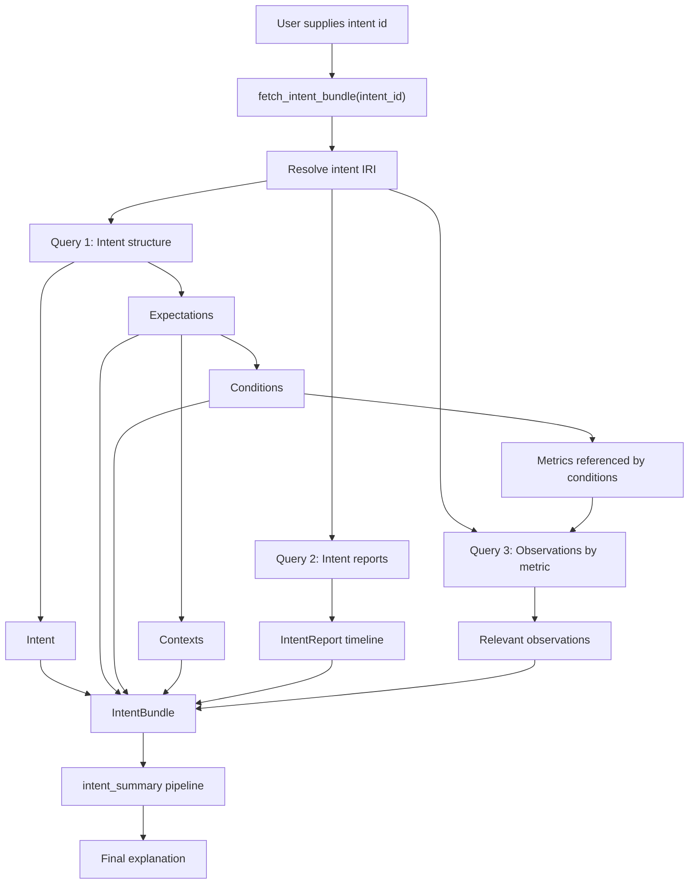

# Intent GraphDB Integration

This document explains how iExplain currently handles TMForum-style intents and intent reports from GraphDB, with a focus on the adapter function `fetch_intent_bundle()`.

The short version is:

- `fetch_intent_bundle()` is the core data adapter between GraphDB and iExplain.
- It does not explain anything by itself.
- It collects the intent structure, intent reports, and relevant observations into one normalized `IntentBundle`.
- The `intent_summary` pipeline then uses that bundle to produce an explanation.

Relevant code:

- Adapter: [src/iexplain/intent_graphdb.py](../src/iexplain/intent_graphdb.py)
- Runtime tool: [src/iexplain/runtime/tools.py](../src/iexplain/runtime/tools.py)
- Intent pipeline: [src/iexplain/runtime/pipelines.py](../src/iexplain/runtime/pipelines.py)
- Local sample intents: [lab/intent_graphdb/sample_data/sample_intents.ttl](../lab/intent_graphdb/sample_data/sample_intents.ttl)
- Local sample reports: [lab/intent_graphdb/sample_data/sample_reports.ttl](../lab/intent_graphdb/sample_data/sample_reports.ttl)

## TMForum Concepts

The current implementation depends on a small subset of the TMForum Intent Ontology.

Primary ontology references:

- `IntentCommonModel.ttl`
  URL: [INTEND-Project/5G4Data-private/TM-Forum-Intent-Toolkit/TMForumIntentOntology/IntentCommonModel.ttl](https://github.com/INTEND-Project/5G4Data-private/blob/main/TM-Forum-Intent-Toolkit/TMForumIntentOntology/IntentCommonModel.ttl)
- `LogicalOperators.ttl`
  URL: [INTEND-Project/5G4Data-private/TM-Forum-Intent-Toolkit/TMForumIntentOntology/LogicalOperators.ttl](https://github.com/INTEND-Project/5G4Data-private/blob/main/TM-Forum-Intent-Toolkit/TMForumIntentOntology/LogicalOperators.ttl)
- `MetricsAndObservations.ttl`
  URL: [INTEND-Project/5G4Data-private/TM-Forum-Intent-Toolkit/TMForumIntentOntology/MetricsAndObservations.ttl](https://github.com/INTEND-Project/5G4Data-private/blob/main/TM-Forum-Intent-Toolkit/TMForumIntentOntology/MetricsAndObservations.ttl)
- Overview: [INTEND-Project/5G4Data-private/TM-Forum-Intent-Toolkit/TMForumIntentOntology/README.md](https://github.com/INTEND-Project/5G4Data-private/blob/main/TM-Forum-Intent-Toolkit/TMForumIntentOntology/README.md)

### Intent

An `Intent` is the top-level object that defines requirements.

Reference:

- `icm:Intent` in [IntentCommonModel.ttl](https://github.com/INTEND-Project/5G4Data-private/blob/main/TM-Forum-Intent-Toolkit/TMForumIntentOntology/IntentCommonModel.ttl)
  Note: see lines around `146-150` in that file.

Practical meaning in iExplain:

- this is the resource identified by the user-supplied intent ID
- it is the root of the subgraph that iExplain traverses

### Expectation

An `Expectation` is a requirement block inside an intent.

Reference:

- `icm:Expectation` in [IntentCommonModel.ttl](https://github.com/INTEND-Project/5G4Data-private/blob/main/TM-Forum-Intent-Toolkit/TMForumIntentOntology/IntentCommonModel.ttl#L119)

Ontology wording:

- an expectation “defines a set of requirements within an Intent”

Practical meaning in iExplain:

- expectations are the first layer under an intent
- examples in the sample data include deployment expectations and network expectations
- reporting expectations are also expectations, but their purpose is to request reports rather than declare service thresholds

### Condition

A `Condition` is a boolean-style requirement or rule used under an expectation.

References:

- `log:Condition` in [LogicalOperators.ttl](https://github.com/INTEND-Project/5G4Data-private/blob/main/TM-Forum-Intent-Toolkit/TMForumIntentOntology/LogicalOperators.ttl#L58)
- `icm:ConditionReport` in [IntentCommonModel.ttl](https://github.com/INTEND-Project/5G4Data-private/blob/main/TM-Forum-Intent-Toolkit/TMForumIntentOntology/IntentCommonModel.ttl#L56)

Ontology wording:

- a condition is a “condition statement with a boolean result”

Important implementation note:

- the current iExplain adapter and the surrounding 5G4Data codebase use `icm:Condition` in SPARQL queries and sample TTL files
- the TMForum logical ontology also defines `log:Condition`
- this is a modeling convention in the current ecosystem, and iExplain follows the practical 5G4Data convention for now

Evidence of current practice:

- [src/iexplain/intent_graphdb.py#L239](../src/iexplain/intent_graphdb.py#L239)
- [sample_intents.ttl#L71](../lab/intent_graphdb/sample_data/sample_intents.ttl#L71)
- public 5G4Data code also queries `icm:Condition`, for example in `intent-report-client/graphdb_client.py`

### Context

A `Context` is extra information that changes how requirements should be interpreted.

Reference:

- `icm:Context` in [IntentCommonModel.ttl](https://github.com/INTEND-Project/5G4Data-private/blob/main/TM-Forum-Intent-Toolkit/TMForumIntentOntology/IntentCommonModel.ttl#L62)

Ontology wording:

- context objects provide “contextual information”
- that information “impacts the interpretation of requirements”

Practical meaning in iExplain:

- context is not the requirement itself
- it is supporting information such as region, datacenter, application, or deployment descriptor

### IntentReport

An `IntentReport` is the top-level report object for an intent.

Reference:

- `icm:IntentReport` in [IntentCommonModel.ttl](https://github.com/INTEND-Project/5G4Data-private/blob/main/TM-Forum-Intent-Toolkit/TMForumIntentOntology/IntentCommonModel.ttl#L153)
- `icm:about` in [IntentCommonModel.ttl](https://github.com/INTEND-Project/5G4Data-private/blob/main/TM-Forum-Intent-Toolkit/TMForumIntentOntology/IntentCommonModel.ttl)
- `icm:reportGenerated` in [IntentCommonModel.ttl](https://github.com/INTEND-Project/5G4Data-private/blob/main/TM-Forum-Intent-Toolkit/TMForumIntentOntology/IntentCommonModel.ttl#L239)
- `icm:reportNumber` in [IntentCommonModel.ttl](https://github.com/INTEND-Project/5G4Data-private/blob/main/TM-Forum-Intent-Toolkit/TMForumIntentOntology/IntentCommonModel.ttl#L261)

Practical meaning in iExplain:

- these are the lifecycle snapshots used to answer “what happened to this intent?”
- they carry state, timestamp, reason, and ownership/handler information

### Observation

An `Observation` is a measured or observed fact for a metric.

Reference:

- `met:Observation` in [MetricsAndObservations.ttl](https://github.com/INTEND-Project/5G4Data-private/blob/main/TM-Forum-Intent-Toolkit/TMForumIntentOntology/MetricsAndObservations.ttl#L65)
- `met:observedMetric` in [MetricsAndObservations.ttl](https://github.com/INTEND-Project/5G4Data-private/blob/main/TM-Forum-Intent-Toolkit/TMForumIntentOntology/MetricsAndObservations.ttl#L78)
- `met:obtainedAt` in [MetricsAndObservations.ttl](https://github.com/INTEND-Project/5G4Data-private/blob/main/TM-Forum-Intent-Toolkit/TMForumIntentOntology/MetricsAndObservations.ttl#L96)

Ontology wording:

- an observation is “a distinct value or fact that was observed or measured for a metric”

Practical meaning in iExplain:

- observations are numerical or factual evidence that support or contradict the conditions inside an intent

### ObservationReportingExpectation

This is relevant even though the current adapter does not require it explicitly.

Reference:

- `icm:ObservationReportingExpectation` in [IntentCommonModel.ttl](https://github.com/INTEND-Project/5G4Data-private/blob/main/TM-Forum-Intent-Toolkit/TMForumIntentOntology/IntentCommonModel.ttl#L189)

Ontology wording:

- this kind of reporting expectation leads to intent reports containing observations for metrics used in the intent

Practical meaning:

- the ontology has a formal concept for observation-containing reports
- the current iExplain adapter is simpler than that and links observations by metric, even when the sample data only uses a generic reporting expectation

## The Current iExplain Data Model

The adapter normalizes GraphDB data into these Python objects in [intent_graphdb.py](../src/iexplain/intent_graphdb.py#L10):

- `IntentBundle`
- `IntentExpectation`
- `IntentCondition`
- `IntentContext`
- `IntentReportRecord`
- `IntentObservation`

This is deliberately smaller than the full TMForum ontology. It is a reasoning-oriented view, not a full ontology mirror.

## How `fetch_intent_bundle()` Works

`fetch_intent_bundle()` is defined at [intent_graphdb.py#L86](../src/iexplain/intent_graphdb.py#L86).

It does three queries:

1. one query for the intent structure
2. one query for top-level intent reports
3. one query for relevant observations

### 1. Intent Structure Query

The structure query is `_intent_bundle_query()` at [intent_graphdb.py#L213](../src/iexplain/intent_graphdb.py#L213).

It starts from the requested intent IRI and traverses:

- `?intent log:allOf ?expectation`
- `?expectation log:allOf ?condition`
- `?expectation log:allOf ?context`

It also extracts:

- expectation type
- expectation description
- expectation target
- condition description
- condition metric
- context description
- context properties and values

The returned rows are grouped into:

- `expectations`
- `conditions`
- `contexts`

### 2. Intent Report Query

The report query is `_reports_query()` at [intent_graphdb.py#L266](../src/iexplain/intent_graphdb.py#L266).

It fetches all `icm:IntentReport` objects such that:

- `?report icm:about ?intent`

and it returns:

- `report`
- `reportNumber`
- `reportGenerated`
- `intentHandlingState`
- `reason`
- `handler`
- `owner`

These rows become `IntentReportRecord` objects.

### 3. Observation Query

The observation query is `_observations_query()` at [intent_graphdb.py#L283](../src/iexplain/intent_graphdb.py#L283).

This is the most important detail to understand.

The query does not ask:

- “which observations are explicitly attached to this report?”

Instead it asks:

- which expectations belong to the intent?
- which conditions belong to those expectations?
- which metrics do those conditions refer to?
- which `met:Observation` rows observe those metrics?

That means the current adapter performs a metric-based join:

- `Intent -> Expectation -> Condition -> Metric -> Observation`

This is why observations can appear in the bundle even though they do not share the same ID as the intent itself.

## Why The Child IDs Differ From The Requested Intent ID

This is expected and correct.

The requested ID refers to the top-level intent resource. Conditions and contexts are separate child resources linked under that intent.

For the deployment sample:

- the intent is [sample_intents.ttl#L59](../lab/intent_graphdb/sample_data/sample_intents.ttl#L59)
- it links to a deployment expectation and a reporting expectation at [sample_intents.ttl#L62](../lab/intent_graphdb/sample_data/sample_intents.ttl#L62)
- the deployment expectation links to:
  - condition `CO9...` at [sample_intents.ttl#L68](../lab/intent_graphdb/sample_data/sample_intents.ttl#L68)
  - context `CXe5...` at [sample_intents.ttl#L69](../lab/intent_graphdb/sample_data/sample_intents.ttl#L69)

So the relationship is:

- the intent contains expectations
- the expectation contains conditions and contexts

That is why `conditions` and `contexts` in the bundle have their own identifiers.

## Worked Example: Deployment Intent

The sample deployment intent is:

- [sample_intents.ttl#L59](../lab/intent_graphdb/sample_data/sample_intents.ttl#L59)

Its expectation is:

- `DE47aad4...` at [sample_intents.ttl#L65](../lab/intent_graphdb/sample_data/sample_intents.ttl#L65)

Its condition is:

- `CO9aa045...` at [sample_intents.ttl#L71](../lab/intent_graphdb/sample_data/sample_intents.ttl#L71)

Its context is:

- `CXe5deca...` at [sample_intents.ttl#L81](../lab/intent_graphdb/sample_data/sample_intents.ttl#L81)

Its intent reports are:

- [sample_reports.ttl#L27](../lab/intent_graphdb/sample_data/sample_reports.ttl#L27)
- [sample_reports.ttl#L36](../lab/intent_graphdb/sample_data/sample_reports.ttl#L36)
- [sample_reports.ttl#L45](../lab/intent_graphdb/sample_data/sample_reports.ttl#L45)

Its observations are:

- [sample_reports.ttl#L81](../lab/intent_graphdb/sample_data/sample_reports.ttl#L81)
- [sample_reports.ttl#L89](../lab/intent_graphdb/sample_data/sample_reports.ttl#L89)

Why do those observations get included?

- the condition uses metric `computelatency_CO9...` at [sample_intents.ttl#L73](../lab/intent_graphdb/sample_data/sample_intents.ttl#L73)
- the observations measure that exact metric at [sample_reports.ttl#L82](../lab/intent_graphdb/sample_data/sample_reports.ttl#L82) and [sample_reports.ttl#L90](../lab/intent_graphdb/sample_data/sample_reports.ttl#L90)

So iExplain treats them as evidence relevant to that intent.

## What Counts As An Observation In iExplain Today

In the ontology:

- an observation is any `met:Observation`

In the current iExplain adapter:

- an observation is a `met:Observation`
- whose `met:observedMetric` matches a metric referenced by a condition reachable from the requested intent

This is an important distinction.

iExplain currently uses:

- a metric-based evidence join

It does not yet require:

- an explicit report-to-observation link
- a condition-report object
- an expectation-report object
- a context-report object

This is a practical simplification, not a full ontology implementation.

## How iExplain Uses The Bundle

The GraphDB tool fetches the bundle and returns it to the runtime as normalized JSON.

Then the `intent_summary` pipeline:

- asks for the bundle once
- reads the timeline, current state, context, and observations
- writes a compact explanation with:
  - intent
  - current status
  - timeline
  - evidence
  - open questions

This is intentionally controlled. The model does not run arbitrary SPARQL itself.

## Diagram

## Current Limitations

The current implementation is useful, but intentionally incomplete.

### It is not a full TMForum report model

The adapter currently fetches:

- top-level `IntentReport`
- structural expectation/condition/context nodes
- metric-matched observations

It does not yet fetch or normalize:

- `ExpectationReport`
- `ConditionReport`
- `ContextReport`
- `resultFrom`
- other report-element-level reasoning links

### Observations are linked by metric, not by explicit report membership

That is a practical simplification. It works well for the current local lab and likely for early integrations, but it may over-include observations if:

- the same metric is reused in multiple contexts
- the graph stores historical observations without a clear intended scope

### The adapter follows the 5G4Data modeling convention

The surrounding 5G4Data ecosystem uses `icm:Condition` widely in practice. The current adapter follows that convention.

This should be revisited later if Freno’s GraphDB uses a stricter or different ontology interpretation.

### The bundle is reasoning-oriented

`IntentBundle` is designed to help explanation, not to preserve every ontology detail.

That is a feature, but it also means:

- information can be flattened
- some ontology distinctions are currently hidden
- future work may require a richer normalized model

## Recommended Future Improvements

The next likely improvements in this area are:

1. Support explicit report-element structures.
2. Distinguish observation provenance more clearly.
3. Add time-window filtering when fetching observations.
4. Clarify the `icm:Condition` vs `log:Condition` assumption against real Freno data.
5. Evolve `IntentBundle` only when there is a concrete use case for the added complexity.

## Summary

`fetch_intent_bundle()` is the current semantic bridge from TMForum-style graph data to iExplain.

It works by:

- starting from the requested intent
- traversing to expectations, conditions, and contexts
- loading intent reports through `icm:about`
- loading observations through metric matching
- returning a compact normalized bundle

If a condition or context in the inspector does not have the same ID as the requested intent, that is expected. Those are child intent elements, not the intent itself.

If an observation appears in the bundle, that currently means iExplain found a `met:Observation` whose metric matched a condition under the requested intent.
